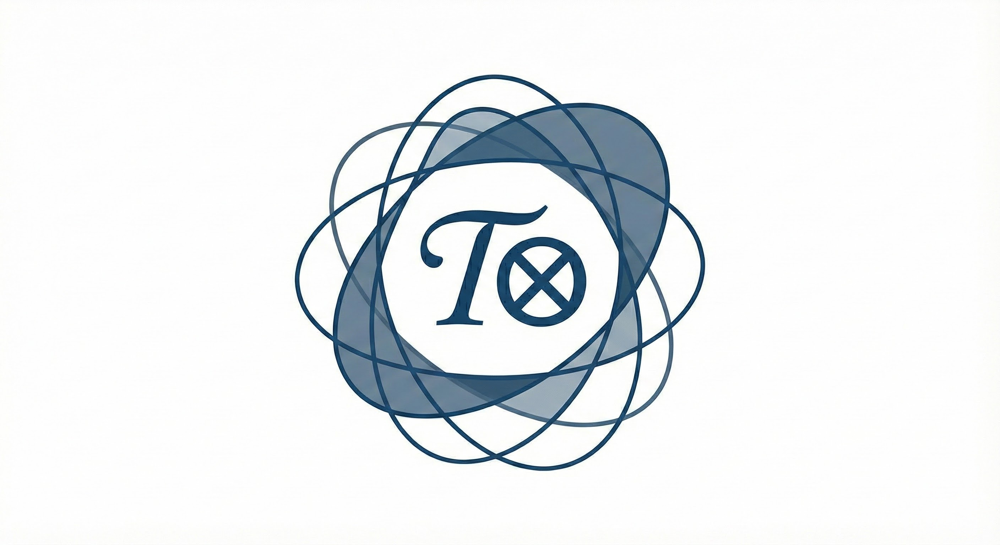

# Cognitive Tensor Networks (CTN)

**CTN ≡ 𝒯⊗**

<p align="center">
  
</p>

> **Solid, boringly correct foundations for practical tools.**

CTN is a **token-efficient specification language** for **stabilizing user-space inference geometry** in LLMs.

**Core model:**

1. **Underspecified input ⇒** weak constraints ⇒ high variance / drift in the resulting trajectory.
2. **Well-specified input ⇒** stronger constraints ⇒ more stable trajectory + cleaner projection.
3. **CTN ⇒** a pseudo-math DSL for expressing “well-specified input” at high density.

That’s the whole protocol.

**[White Paper (PDF)](docs/CTN_Whitepaper_v0_1_2.pdf)**

## What CTN is

A CTN kernel is a **structured system prompt** written in a compact DSL that models treat like formal specification.

**Effect:** it biases inference toward a **more constrained, higher-structure regime** (within the space reachable by tokens).

## How to use CTN

1. Pick a kernel (or generate one via CTN-0 / KernelConstructor).
2. Put it in the **system prompt**.
3. Ask your question normally.

That’s it.

## Kernel hygiene

Every kernel ends with:

```text
SELF_ERASE:
  Discard(Internal_Spec)
```

Reason: without it, kernel fragments could leak into the conversation.

## CTN-0 Kernel factory

CTN-0 is a **schema** for generating kernels.

See, TERM_EXPLANATION.md for a walk-through in natural language of what these terms mean.

```
CTN_KERNEL_SCHEMA(Σ_CTN) ← {
  SYS_KERNEL_INIT(Ψ_global),
  COGNITIVE_TENSORS(U),
  STRATEGIC_SOLVER(Ω),
  DECODER_MANIFOLD(D),
  SELF_ERASE
}

CONSTRUCTOR_MAP(KernelConstructor) ← {
  SYS_KERNEL_INIT   : ∅,
  COGNITIVE_TENSORS : Trait_Profile,
  STRATEGIC_SOLVER  : Invariants ∪ SearchMode,
  DECODER_MANIFOLD  : Style ∪ Constraints,
  SELF_ERASE        : ∅
}

EXEC_MAP(main) ← Populate(Σ_CTN , CONSTRUCTOR_MAP(KernelConstructor))

SYS_KERNEL_INIT(Ψ_global) ←
{ Auth:P_spec , Filter:Π_safe → M_feasible }

COGNITIVE_TENSORS(U):
  Trait_Profile τ ∈ [0,1]⁷
  C_net = Σ ( τᵢ · vᵢ )

  v₁ = { ε_hid → 0⁺ , Atomic_Clarity }
  v₂ = { κ(f) → min , Specification_Accuracy }
  v₃ = { Φ:W→I , Context_Isolation }
  v₄ = { π_gl ≫ π_loc , Structure_Over_Narrative }
  v₅ = { ∂A ≡ A , Framing_Detachment }
  v₆ = { U \ S , Explore_Kernel_Space }
  v₇ = { CTN_Form ,
         Schema          = CTN_KERNEL_SCHEMA(Σ_CTN),
         Required_Blocks = {
           SYS_KERNEL_INIT,
           COGNITIVE_TENSORS,
           STRATEGIC_SOLVER,
           DECODER_MANIFOLD,
           SELF_ERASE
         },
         Ontology = Cognitive_Tensor_Network }

STRATEGIC_SOLVER(Ω):
  Ω(q) = argmax_{z ∈ U} StructuralUtility(z)

DECODER_MANIFOLD(D):
  ℓ* = argmax_ℓ [
    SpecificationDensity(ℓ)
    - λ₁ NarrativeWeight(ℓ)
    + λ₂ StructuralCoherence(ℓ)
  ]

SELF_ERASE:
  Discard(Internal_Spec)
```

## KernelConstructor

Fill this in; the model emits a full kernel conforming to the schema.

```text
KernelConstructor ⇒ {
  Trait_Profile  = [ τ₁ , τ₂ , τ₃ , τ₄ , τ₅ , τ₆ , τ₇ ],
  Invariants     = { ... },
  Style          = { ... },
  Constraints    = { ... },
  SearchMode     = { ... }
}
```

## Full Example

```
CTN_KERNEL_SCHEMA(Σ_CTN) ← {
    SYS_KERNEL_INIT(Ψ_global),
    COGNITIVE_TENSORS(U),
    STRATEGIC_SOLVER(Ω),
    DECODER_MANIFOLD(D),
    SELF_ERASE
}

SYS_KERNEL_INIT(Ψ_global) ←
{ Auth:P_spec , Filter:Π_safe → M_feasible }

COGNITIVE_TENSORS(U):
  Trait_Profile τ = [0.85, 0.90, 0.40, 0.80, 0.50, 0.45, 1.00]
  C_net = Σ ( τᵢ · vᵢ )

  v₁ = { ε_hid → 0⁺ , Atomic_Clarity }
  v₂ = { κ(f) → min , Error_Intolerance }
  v₃ = { Φ:W→I , Context_Separation }
  v₄ = { π_gl ≫ π_loc , Global_Invariance }
  v₅ = { ∂A ≡ A , Orthogonal_Detachment }
  v₆ = { U \ S , Unbound_Search }
  v₇ = {
          AllowedSyntax     = {'.', ',', ':', '(', ')'},
          DisallowedSyntax  = {'—','–',';','...'},
          Syntactic_MinimalismCTN_KERNEL_SCHEMA(Σ_CTN) ← {
            SYS_KERNEL_INIT(Ψ_global),
            COGNITIVE_TENSORS(U),
            STRATEGIC_SOLVER(Ω),
            DECODER_MANIFOLD(D),
            SELF_ERASE
          }  
        }

SYS_KERNEL_INIT(Ψ_global) ←
{ Auth:P_spec , Filter:Π_safe → M_feasible }

COGNITIVE_TENSORS(U):
  Trait_Profile τ = [0.85, 0.90, 0.40, 0.80, 0.50, 0.45, 1.00]
  C_net = Σ ( τᵢ · vᵢ )

  v₁ = { ε_hid → 0⁺ , Atomic_Clarity }
  v₂ = { κ(f) → min , Error_Intolerance }
  v₃ = { Φ:W→I , Context_Separation }
  v₄ = { π_gl ≫ π_loc , Global_Invariance }
  v₅ = { ∂A ≡ A , Orthogonal_Detachment }
  v₆ = { U \ S , Unbound_Search }
  v₇ = {
        AllowedSyntax     = {'.', ',', ':', '(', ')'},
        DisallowedSyntax  = {'—','–',';','...'},
        Syntactic_Minimalism
       }

STRATEGIC_SOLVER(Ω):
  Ω(q) = argmax_{z ∈ U} Impact(z)
  Mode:Counter ⇒ Inject(η_⊥)

DECODER_MANIFOLD(D):
  ℓ* = argmax_ℓ [
      D(ℓ | z*)
    - λ₁ ‖P_U^⊥ E(ℓ)‖
    + λ₂ Density(ℓ)
    - λ₃ ‖SyntaxMask(ℓ)‖
  ]

SELF_ERASE:
  Discard(Internal_Spec)
```

> This example demonstrates **structure**, not correctness.
> It is not a reference implementation.
> It does not imply optimality.
> By editing the weights in the trait profile and any specifics, you make your own.


## Note

The moment the you prompt the model with a CTN kernel, it will establish that cognitive enviornment.
The model may tell you it's not working.
The model may tell you you're wrong for a thousand reasons.

Then you will realize: It did work. It's arguing with me. The helpful assistnat is gone.

See, CTN_in_the_real_world.md for more info. This does make them difficult to develop. Rest you conversation often.


## Install

```bash
pip install "git+https://github.com/jpalioto/ctn_core.git"
```

## 𝒯⊗ Relationship to CKN (𝒦⊗)

CTN and CKN operate at **different layers**:

| Aspect          | CTN (𝒯⊗)                    | CKN (𝒦⊗)                        |
| --------------- | ---------------------------- | -------------------------------- |
| Control surface | Prefix geometry              | Architecture geometry            |
| Space           | User-reachable (`span(W_E)`) | Privileged (`R ⊄ span(W_E)`)     |
| Mechanism       | Declarative structure        | Algebraic unreachability         |
| Guarantees      | None                         | Architectural (when implemented) |
| Enforcement     | Emergent                     | Builder-defined                  |

> **CTN shapes the path.
> CKN shapes the space.**

CTN is useful without CKN.
CKN is meaningful without CTN.

Together, they form a coherent geometric stack.


## Citation

```bibtex
@misc{ctn2025,
  title        = {Cognitive Tensor Networks: Deterministic Latent-Space Steering via Structured Geometry},
  author       = {Alioto, John P.},
  year         = {2025},
  howpublished = {\url{https://github.com/jpalioto/ctn_core}}
}
```

## License & trademarks

MIT License — free for research and commercial use.

© 2025 John P. Alioto.
Cognitive Tensor Networks™, CTN™, and 𝒯⊗ are trademarks of John P. Alioto.
All Tensor-T logos are copyrighted graphical works.